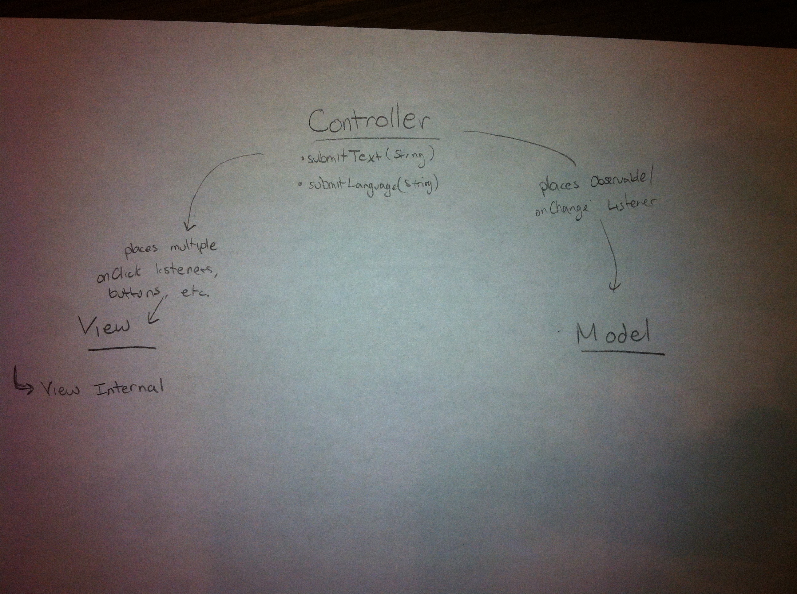
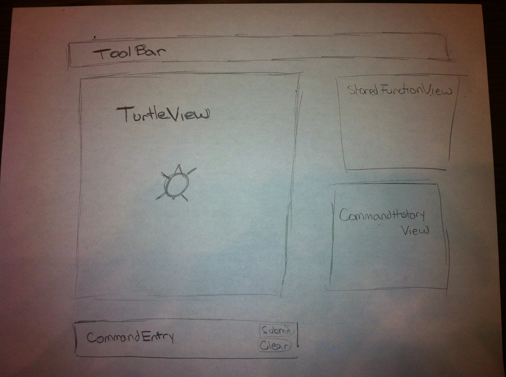

I DESIGN
======

Introduction
------------
The goal of this project is to develop an integrated development environment for a
simplified version of the programming language Logo, named "SLogo". There are two main
design goals in mind for this project. First, we want to ensure that the back-end part
of the project (e.g. command parsing, function storage, control of the dataStorage) is
separated from the front-end part of the project (e.g. graphic display, handling of
user input). This will allow us to work on each half of the project independently, as
long as we spend time in the beginning carefully designing how these two halves of
the project need to interact. This is a part of our second design goal, to design an
API that is complete and well-defined, and flexible enough to handle future extensions.

In general, the front-end and back-end are completely closed off from one another. We
achieve this separation through implementation of the Model-View-Controller architecture.
User input is handled by a single controller class, which is also responsible for
sending signals between the various front-end components and the back-end. Each
component of the SLogo IDE is designed in its own class, to promote code modularity
and future extensibility (i.e. allow for future components to be added or current ones
to be edited with ease). Furthermore, the back-end is designed to be flexible through
use of abstract command classes to allow for easy addition of new rules and commands
in the future. The back-end is connected to the front-end through the use of Java's
Observer/Observable classes. In essence, objects in the Model are bound to their relevant
objects in the View, such that the GUI is updated automatically whenever objects in the
Model change.

Design Overview
---------------
We'll begin by describing the front-end, or "View", component of our project. SLogoGUI
is the main container class, and is responsible for maintaining the proper layout of
all other elements within the scene. The main element within the GUI is TurtleView,
which displays the dataStorage as it draws the commands passed into it. Every time the
dataStorage's state is updated in the back-end, TurtleView will automatically update as well,
through bindings to a TurtleState object in the Model. CommandEntryBox will be beneath, and
contains a text box for entering the SLogo commands, as well as a button for submitting
and a button for clearing the text. Across the top of the GUI will be ToolBar, a
which will contain options for the user to change, such as background color,
SLogo language, dataStorage image, etc. Along the right-side will be a panel with multiple
tabs for the user to select. One of these is StoredFunctionView, which will
contain a vertical list of any functions and variables that have been defined so far.
There will also be CommandHistoryView, which will contain previously entered commands,
as well as their result (e.g. with the proper error message in case the command was
not parsed correctly). Both CommandHistoryView and StoredFunctionView will be clickable,
such that the clicked function/command will be entered into the CommandEntryBox. Any
internal interactions between the various View elements will be set up through the
SLogoController class through the use of EventListeners/Handlers. For example,
SLogoController will create the appropriate ClickListener so that when a command in
StoredFunctionView is clicked, it is properly loaded in to the TextEntryBox.

The back-end, or "Model", component is mainly controlled by the SLogoModel class.
SLogoModel will be the only part of the Model that View sends information through,
helping to ensure that the back-end is completely independent of the front-end
implementation. SLogoModel contains a CommandParser class, which reads in a String of
command input, and determines the proper Commands to excecute through the use of
expression trees and regex parsing. Command will be an abstract class, with a single
abstract method doCommand() that will be overriden for each different SLogoCommand.
SLogoModel will execute these commands one-by-one.
Whenever the dataStorage is updated, a Turtle class will be responsible
for correctly updating the current position, orientation, etc. of the Turtle through
methods like move(), rotate(), etc. This will update position of an observable TurtleState
object. There will also be a FunctionStorage class for keeping track of the different
variables and functions that have been defined thus far.

Communication between the two components is relatively simple. The front-end only needs
one method of communication to the back-end, namely the submitCommandText(String text),
located within SLogoController. This method is executed whenever the user clicks the
submit button within CommandEntryBox. Upon calling this method, the Model will first
parse the text, and then SLogoModel will execute the commands one-by-one. TurtleState will
be bound to TurtleView, just as FunctionStorage will be bound to StoredFunctionView, ensuring
that GUI elements are appropriately updated as their related Model elements change.
If an error is encountered, it will be thrown by Model, and dealt with by SLogoController
(e.g. CommandHistory will store the command in Red and display the error message).

User Interface
--------------
Overall, the user interface (UI) will be structures as rearrangable boxes within a main scene.
Each component of the UI will have domain over a specific Group it is given, and must stay
within the specified dimensions of that Group. Ideally within each Group, each element will
be placed relative to the given dimensions, rather than absolutely. This will allow us to
resize and rearrange each element of the UI at will, and therefore will allow us to add any
new front-end user-enabled features as necessary. The goal is to have GUI elements that can
function independently (other than the events that need to be sent between them), to allow
for easy flexibility in design.

As described in the previous section "Design Overview", the UI will contain several elements
with which the user may interact and use to view the results of their actions. Please see the
image included below for currently proposed placement of each view element, and see the section
above for the rest of the UI description.

The user may enter valid commands into the CommandEntryBox. Regardless of the result and
correctness of the command, it will then immediately show up in the CommandHistoryView.
The use of the CommandHistoryView is similar to the Console window of the Eclipse IDE:
here, the user will see the previous (clickable) commands which they entered, as well as any possible
error messages which the commands may have triggered. Upon the user entering executable commands, the
dataStorage in the TurtleViewer will move to complete the commands, even if the commands end in a command
that may throw an error.

API Details
-----------
**View (Internal)**
* SLogoController
  * Various EventListeners
* SLogoView
  * CommandEntryBox
    * getCommandText()
  * ToolBar
  * TurtleView
    * draw()
  * HelperPanel
    * StoredFunctionView
      * getClickedFunction()
    * CommandHistoryView
      * getClickedCommand()

**View (External)**
* SLogoController
  * submitCommandText(String text)
  * submitLanguage(String language)

**Model (Internal)**
* CommandMaker
	* parseText(String str); returns commandTree
    * createCommands(commandTree); returns commandsQueue
* CommandExecutor
	* execute(Command[?] cmd); returns commandReturn
* Turtle
	* updateTurtle()

**Model (External)**
* SLogoModel
	* TurtleState
    * FunctionStorage
    * ErrorFlagger
    	* setErrorFlag(String errorType)

API Example Code
----------------
1. User types in fd 50
User types into the text box within CommandEntryBox and then clicks the Submit button within it.
Clicking the submit button triggers an EventListener created within SLogoController
(submitButtonListener). This listener calls getCommandText() within CommandEntryBox to return the
String of text entered. SLogoController then calls submitCommandText, which passes the text to
SLogoModel and prints the command to CommandHistory. SLogoModel parses the text, and then executes the
Commands in order, at a specific rate. As TurtleView and/or FunctionStorage are updated by these commands,
the related View classes are updated as well, through binding.
2. View Internal Example: User clicks on a function in the FunctionStorageView
A ClickListener (reated by SLogoController is triggered by the click). SLogoController determines that
FunctionStorageView is currently active (rather than CommandHistoryView), and passes the x, y coordinates
of the click to getClickedCommand() within FunctionStorageView. This returns the String name of the function
which is placed within CommandEntryBox through a setText() method.
3. View External Example: User sets a new language through the toolbar.
User clicks on the select language section of the toolbar, which opens a ComboBox for them to select a language.
Once they click the language, a ChangeListener (languageListener) within SLogoController will receive the newly
selected language, and call setLanguage(). This will in turn tell SLogoModel to call setLanguage within CommandParser,
to load the newly selected language resource.
4. Model Internal Example: `fd (fd 50)` is passed in as the string to parse.
parseText()--the command tree is made: fd -> fd -> 50. From this tree, createCommands() is called on the commandTree, and
the following list of commands is made: [fd50, fd50]. Where how the actual commands look will be determined later.
execute() is then called on the list of commands. One by one, each command is applied. If the command applies
to the Turtle, then updateTurtle() is called appropriately. Upon updating the Turtle, the TurtleState is updated
through binding.
5. Model External Example: the user enters the command `fs 50`.
parseText() is called on the command. The 'fs' cannot be matched to any existing pattern. This means
something is wrong with the command. parseText() throws an error, which is caught by the ErrorFlagger.
It then calls setErrorFlag(); upon setting, a listener from the controller sees that an errorFlag was raised.
The error message is passed to be displayed in the GUI.

Design Considerations
---------------------
The largest discussion we had over the design was simply what components should be part of the
back-end, and which components should be handled by the front-end or the controller. For instance,
the Turtle class is extremely important to both the Model and View components, so we had to figure
out the best way to make sure both parts had access to it. In the end, we decided that Turtle
belonged to the back-end, but that we would provide access to necessary variables through the use
of a TurtleState object. The goal when dividing the classes was to make sure that the Model could
function independently (i.e. nothing in the model logic was dependent on the implementation of the
View or Controller parts of the project).

Another consideration was how to tell the View to update the GUI with new information from Model.
We first considered simply letting SLogoController control updating of both the View and Model.
For example, SLogoController would tell the back-end to parse the given text and update appropriately,
and then would tell the GUI to update once the back-end was finished. However, this requires to much
communication between the SLogoController and the Model, so we decided to let the Model instead act
more independently, and the View to be updated through Java's Observable/Observer classes instead.

We also had difficulty determining how we actually want to represent commands that are parsed by
the Model. While the details still need to be hashed out, we decided it would be best to begin
with an overall abstract Command class, with a doCommand() method to be overriden by all subclasses.
We may create abstract subclasses of this Command class as well, such as TurtleCommand,
MathCommand, etc.

Finally, we had to consider how errors would be handled. We decided that in the case the Model
is provided with incorrect text to parse, it will throw the Error and stop parsing any more commands
from the submitted text. The error will be caught by the SLogoController, which will then be responsible
for communicating the exception to the GUI appropriately (i.e. display the error message to CommandHistory).

Team Responsibilities
---------------------
Will and James are working on the front-end, while Michael and Filip are working on the back-end.
We will meet again early next week to ensure that both teams are on the same page in terms of how
everything should interact, and then will mostly work on each component independently. Specific
responsibilities will be:

**Will**
Focus on the overall layout of the GUI classes and how they interact through SLogoView and SLogoController.

**James**
Focus on implementation of the individual GUI elements.

**Filip**
* Turtle
* Turtle State
* Controller Listener for Error

**Michael**
* Command Parsing
* Expression Tree
* Syntax errors
